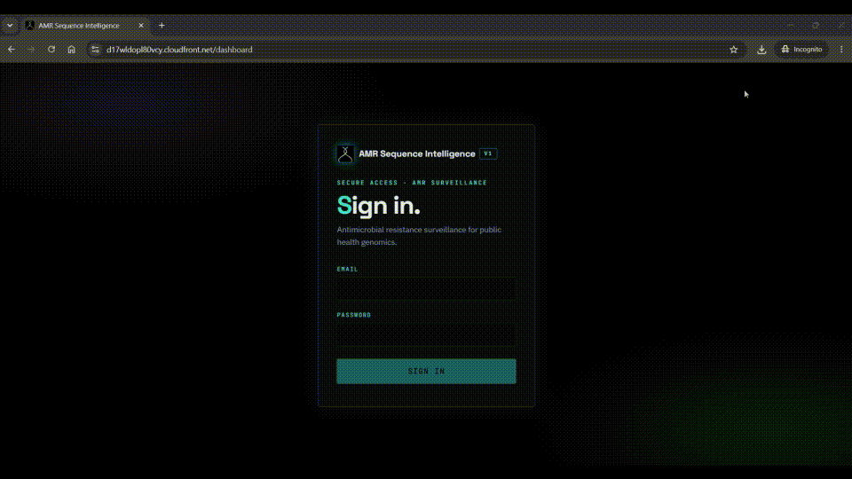
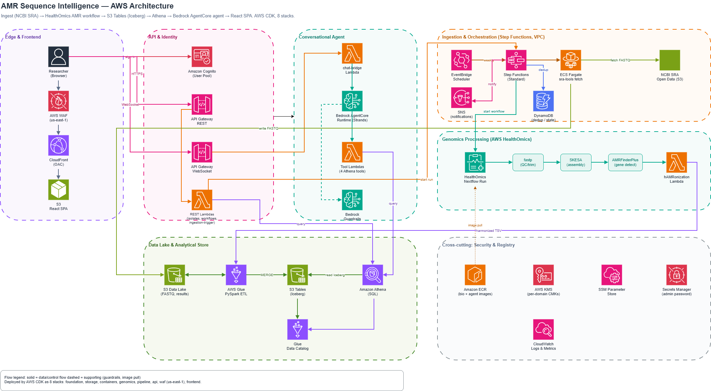

# AMR Sequence Intelligence

An end to end platform for antimicrobial resistance (AMR) genomic surveillance on AWS, with a natural language agent so people who are not bioinformaticians can ask questions about resistance patterns in plain English. The whole system is defined in AWS CDK and deploys into any AWS account with a single command.

The demo below can take a moment to load. If it does not appear, [watch the walkthrough here](https://github.com/NicoloAlbanese/amr_genomic_agentic_platform/blob/main/media/AMR_Genetic_Analysis_Agent.gif).



---

## 1. Introduction

Antimicrobial resistance is one of the larger public health challenges of our time: bacteria evolve to survive the drugs meant to kill them, and tracking which resistance genes appear in which organisms, where, and over time is essential for surveillance programs. The raw data exists. Public sequencing archives such as the NCBI Sequence Read Archive (SRA) hold hundreds of thousands of bacterial whole genome sequencing runs. Turning that data into an answer, though, normally means stitching together a bioinformatics pipeline, an analytical store, and a query layer, and then knowing enough genomics and SQL to interrogate it.

This project builds that path once, as reproducible infrastructure, and puts a conversational layer on top:

- It ingests public whole genome sequencing reads from the NCBI SRA mirror on AWS Open Data.
- It assembles each genome and screens it for AMR genes using established bioinformatics tools on AWS HealthOmics managed workflows.
- It harmonizes the results into a queryable Apache Iceberg store.
- It exposes everything through a web app where a person can ask, for example, "what resistance genes were found in Salmonella?" and get a grounded answer that cites the specific gene, the tool that detected it, and a confidence value.

The intent is to show a realistic, working reference architecture: real public data, real genomics tooling, and an agent that is constrained to answer only from the data actually in the store. It is a demonstration platform rather than a clinical or regulatory system, and it is not a substitute for expert interpretation of genomic results.

---

## 2. Architecture



The editable source for this diagram is in [`media/architecture.drawio.xml`](media/architecture.drawio.xml) (open it with [draw.io](https://app.diagrams.net/)).

The platform is a set of loosely coupled stages. Data flows in one direction: ingest, process, store, then query.

- **Ingestion and orchestration.** An EventBridge Scheduler rule (weekly) or an on demand REST call starts an AWS Step Functions Standard workflow. An ECS Fargate task running `sra-tools` pulls the paired FASTQ files for each accession from the NCBI SRA Open Data S3 bucket. DynamoDB records each processed isolate so repeat runs skip work already done.
- **Genomics processing.** AWS HealthOmics runs a single Nextflow workflow that chains three steps: fastp for read quality control and trimming, SKESA for de novo assembly, and AMRFinderPlus for resistance gene detection. Merging the steps into one run avoids a fragile hand off between separate runs. The container images are pulled from Amazon ECR, and the AMRFinderPlus database is baked into its image because HealthOmics tasks have no internet access.
- **Harmonization and ETL.** A Lambda normalizes the detection output into the hAMRonization schema. An AWS Glue PySpark job then merges those rows into two Apache Iceberg tables on Amazon S3 Tables: `amr_profiles` (one row per detected gene) and `isolate_metadata` (one row per isolate, with provenance and license). The merge is idempotent on isolate and gene, so re-running an isolate updates rows in place.
- **Analytical store.** Amazon Athena queries the Iceberg tables through the Glue Data Catalog.
- **Conversational agent.** A Strands agent hosted on Amazon Bedrock AgentCore Runtime (Anthropic Claude, invoked through a cross-Region inference profile) answers AMR questions using four Athena backed tools. Amazon Bedrock Guardrails keep the answers grounded and on topic.
- **Frontend and access.** A React single page app is served from Amazon S3 behind Amazon CloudFront (origin access control, protected by AWS WAF) and authenticated with Amazon Cognito. API Gateway REST handles control plane calls; API Gateway WebSocket streams the agent conversation.

Cross cutting concerns: AWS KMS provides per domain customer managed keys, SSM Parameter Store carries deploy time values (such as the HealthOmics workflow id) between stages, Secrets Manager holds the generated demo password, and CloudWatch collects logs and metrics.

### Stacks

The platform is 8 CDK stacks. CDK resolves the deploy order from the dependency graph, so `cdk deploy --all` deploys them in the right order and skips unchanged stacks. There are no hardcoded account identifiers: every resource name derives from a `RESOURCE_PREFIX`, cross stack values flow through native CDK references, and the frontend loads its configuration at runtime from a generated `runtime-config.json`.

| Stack | Purpose |
|---|---|
| `<PREFIX>-amr-foundation` | KMS customer managed keys, SSM namespace |
| `<PREFIX>-amr-storage` | S3 data lake, S3 Tables (Iceberg), DynamoDB, Glue catalog, Athena workgroup |
| `<PREFIX>-amr-containers` | ECR repositories and the bioinformatics and agent Docker images |
| `<PREFIX>-amr-genomics` | HealthOmics workflow (fastp, SKESA, AMRFinderPlus) |
| `<PREFIX>-amr-pipeline` | Step Functions, EventBridge Scheduler, ECS, Glue ETL, SNS, VPC |
| `<PREFIX>-amr-api` | Cognito, API Gateway REST and WebSocket, Lambdas, Bedrock AgentCore, Guardrails |
| `<PREFIX>-amr-waf` | CloudFront WAF WebACL (deployed to `us-east-1`) |
| `<PREFIX>-amr-frontend` | Frontend S3 bucket and CloudFront distribution, generates the SPA runtime config |

Dependency edges: storage and containers depend on foundation; genomics depends on storage; pipeline depends on storage, genomics, and containers; api depends on storage and pipeline; frontend depends on api and waf.

### Repository layout

```
infra/            CDK app (bin/app.ts) and the 8 stacks (lib/*.ts)
src/api/          REST and WebSocket Lambda handlers, custom resources
src/lambdas/      Pipeline Lambdas (ingestion, dedup, hAMRonization, concordance) and the agent tools
src/containers/   Dockerfiles and the agent runtime entrypoint
src/workflows/    HealthOmics Nextflow workflow (fastp, SKESA, AMRFinderPlus)
src/glue-scripts/ PySpark ETL that writes the Iceberg tables
frontend/         React SPA (Vite); loads /runtime-config.json at runtime
scripts/          deploy.sh and deploy.ps1
```

---

## 3. How to deploy

### Dependencies

Install these before deploying:

- **Node.js 18 or newer** and npm
- **AWS CDK v2**, invoked through `npx` (no global install needed)
- **Docker**, running (the containers stack builds and pushes images)
- **AWS credentials** for the target account, exported in your shell
- **AWS CLI**, for retrieving outputs after deployment

The target account must be CDK bootstrapped in both the application Region and `us-east-1` (the WAF stack is CloudFront scoped and must live in `us-east-1`). The deploy script does this for you.

### Deploy with the script (recommended)

The script validates inputs, bootstraps both Regions, builds the frontend, runs CDK, and stages the Glue script and the S3 Tables Iceberg catalog client JAR into the data lake bucket. It deploys all stacks or a single stack and hardcodes nothing.

Linux or macOS:

```bash
export RESOURCE_PREFIX=amr-demo     # lowercase letters, digits, hyphens
export AWS_REGION=us-west-2         # optional; defaults to us-west-2
# AWS credentials must be set in the environment

./scripts/deploy.sh                 # all stacks, dependency order
./scripts/deploy.sh api             # single stack, fast (uses --exclusively)
./scripts/deploy.sh --list          # list stack suffixes
```

Windows (PowerShell):

```powershell
$Env:RESOURCE_PREFIX = "amr-demo"
./scripts/deploy.ps1                 # all stacks
./scripts/deploy.ps1 -Stack api      # single stack
./scripts/deploy.ps1 -List
```

Single stack deploys use `cdk deploy --exclusively` so CDK skips no op changesets on already deployed dependency stacks, which is much faster when iterating on one stack. Their dependencies must already exist in the account. Script toggles (environment variables): `SKIP_FRONTEND_BUILD=1` reuses an existing `frontend/dist`; `SKIP_BOOTSTRAP=1` skips `cdk bootstrap`.

### Deploy with raw CDK

```bash
export RESOURCE_PREFIX=amr-demo
export RUN_ID=deploy-001
export AWS_REGION=us-west-2
export CDK_DEFAULT_ACCOUNT=$(aws sts get-caller-identity --query Account --output text)

npm ci && (cd infra && npm ci)
(cd frontend && npm ci && npm run build)   # the frontend stack packages frontend/dist

cd infra
npx cdk bootstrap "aws://${CDK_DEFAULT_ACCOUNT}/${AWS_REGION}"
npx cdk bootstrap "aws://${CDK_DEFAULT_ACCOUNT}/us-east-1"   # WAF is CloudFront scoped

npx cdk deploy --all --require-approval never --concurrency 4
# Single stack: npx cdk deploy "${RESOURCE_PREFIX}-amr-api" --exclusively --require-approval never
```

If you deploy with raw CDK rather than the script, also stage the Glue assets once (the script does this automatically): upload `src/glue-scripts/amr_etl.py` to `s3://<PREFIX>-amr-data-lake/glue-scripts/` and the S3 Tables Iceberg catalog client JAR to `s3://<PREFIX>-amr-data-lake/glue-jars/`. The Glue job only reads these at pipeline run time, so staging them after the deploy is fine.

### After deployment

Retrieve the live endpoints and the demo admin credentials:

```bash
# Frontend URL, REST and WebSocket URLs, Cognito IDs
aws cloudformation describe-stacks --region "$AWS_REGION" \
  --stack-name "${RESOURCE_PREFIX}-amr-frontend" --query "Stacks[0].Outputs" --output table
aws cloudformation describe-stacks --region "$AWS_REGION" \
  --stack-name "${RESOURCE_PREFIX}-amr-api" --query "Stacks[0].Outputs" --output table

# Demo admin sign in: admin@<RESOURCE_PREFIX>.example.com
aws secretsmanager get-secret-value --region "$AWS_REGION" \
  --secret-id "${RESOURCE_PREFIX}/amr/cognito/admin-password" \
  --query SecretString --output text
```

The password is generated at deploy time and stored only in Secrets Manager. The SPA fetches `/runtime-config.json` (generated by the frontend stack from live stack outputs) at startup, so the same build works in any account with no rebuild.

### Destroying

```bash
cd infra
npx cdk destroy --all
```

Destroying deletes all S3 data, DynamoDB tables, and Iceberg tables. Back up anything you need first.
